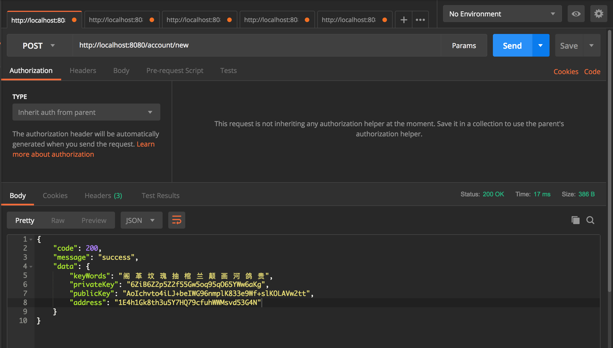
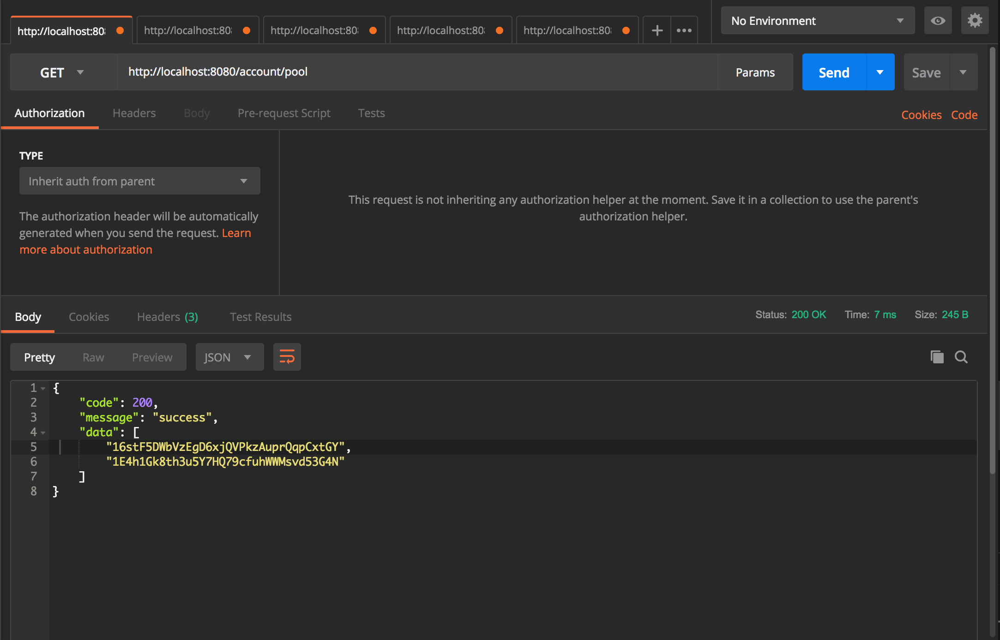
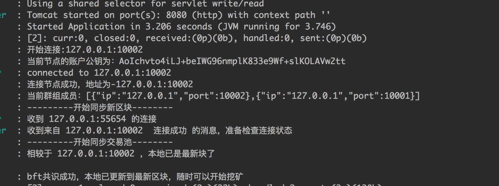
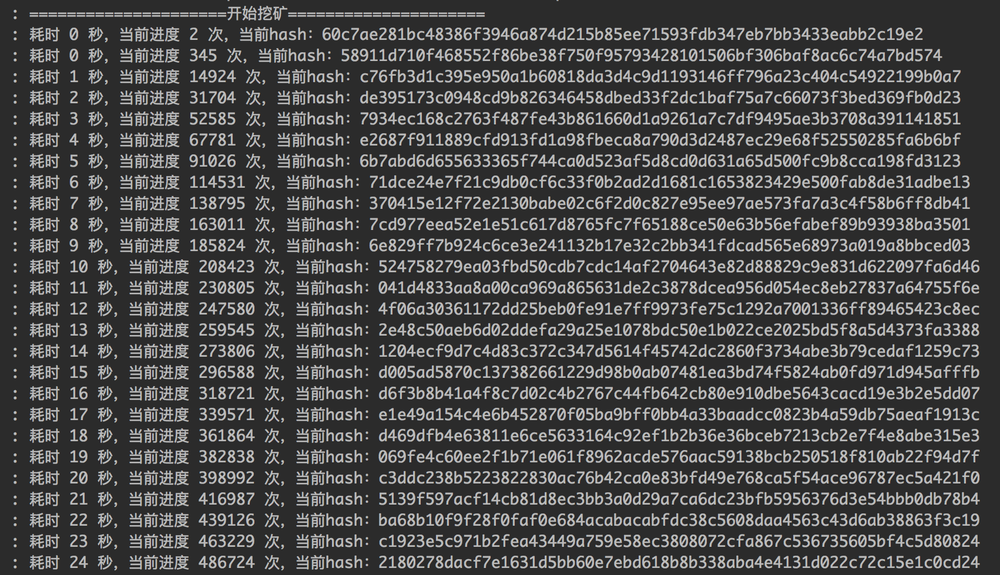
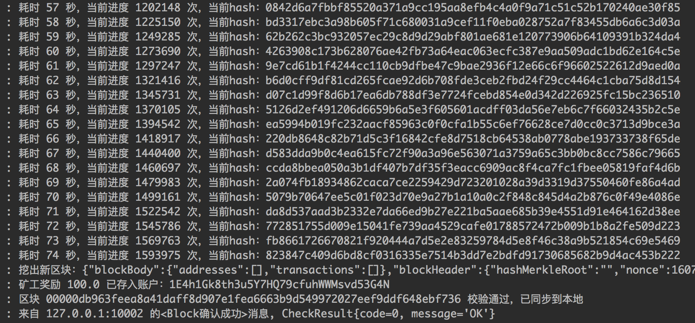
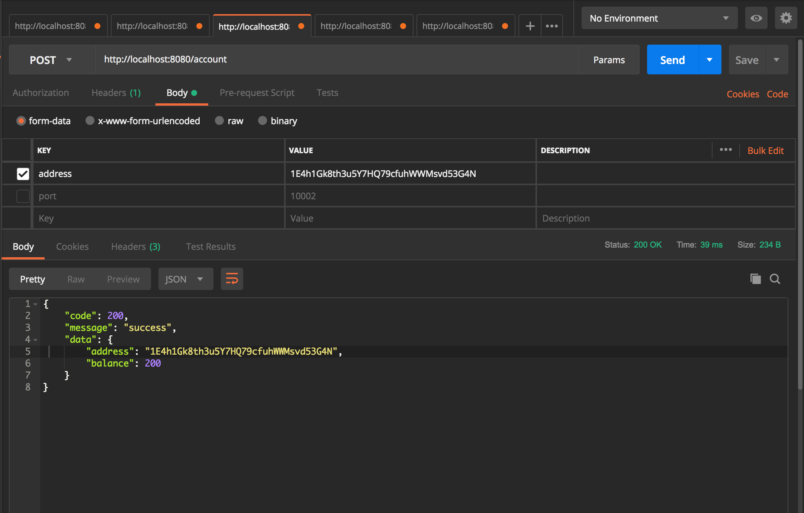
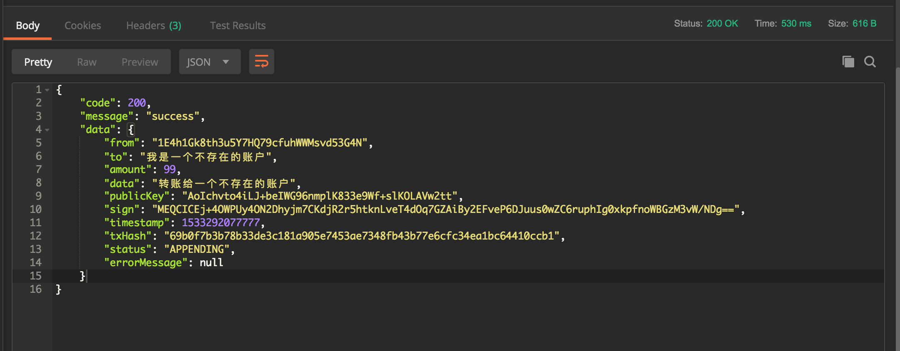
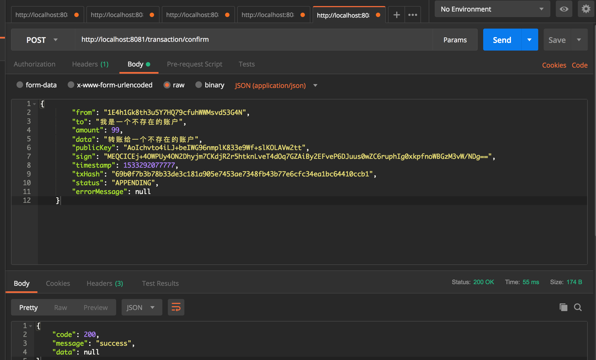
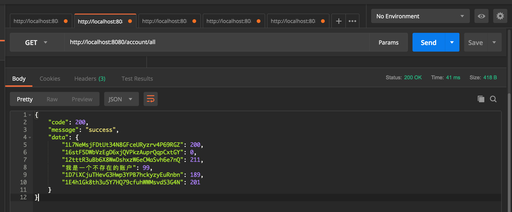

# 基于POW的P2P公链简单实现
### 开发平台 ：Java 1.8
### 作者 ：yumira  &#160;&#160;&#160;&#160;yjhzxhyzq@126.com  &#160;&#160;&#160;&#160;vx:yjhzxhyzq

## 项目说明：
    主要P2P网络模块，POW共识算法和BFT容错算法，加解密类库，请求处理模块，区块处理及校验模块，数据持久化模块
    
## 项目特色
    1.完全去中心化，只由节点构成P2P网络
    2.为了方便记忆，本项目支持私钥格式为12个汉字或者原私钥字符串，二者任意其一都可进行签名，校验，发送交易等
    3.支持挖矿，矿工奖励，交易转账
    4.支持自定义挖矿难度和矿工奖励
    5.新节点连接区块链网络中的任意一个节点后，可迅速抓取到目前网络中所有在线节点并与其生成TCP长连接，节点数据会自动入库，下次启动遍主动连接对方
    6.新节点连接至P2P网络后，不考虑女巫攻击的情况下，会自动从本地最末区块同步到当前最新区块，并根据拜占庭容错算法判断是否完成同步
    7.账户数据及交易记录存在区块体中，同步区块的同时，本地账户数据(余额)也会一起同步至最新
    8.支持区块的回滚，如果由于网络阻塞等原因，收到跟本地最末尾区块相同区块高度的多个区块，且hash校验都通过，代表区块链产生分叉，此时会回滚交易数据和回收矿工奖励
    

## P2P网络模块 com.blockchain.core.net 包

    1.使用t-io框架管理连接通道和组群，所有数据在网络中传输都要经过重新编码和打包
    2.server:每个节点对外暴露一个接收TCP连接请求和数据包处理的serverIp和serverPort,收到数据包解码后，根据消息类型分发给相应的消息处理器做处理，server端口只有一个，最大可被当前网络中的N-1个节点连接
    3.client:每一个TCP连接对应的client端，这里接收和处理其他节点作为server对己方数据返回的响应，client端口会有很多个,会连接N-1个其他节点的server

## POW共识算法和BFT容错算法
    1.挖矿的算法：从交易池和账户池取出数据打包为区块体，再根据区块体计算出区块头，反复递增nonce，直到 Hash256(BlockBody+BlockHeader) 计算出的16进制结果小于某个难度阈值计算出的大整型，这里要注意的是，上述过程中，区块体中的数据和区块头中的时间戳是不断变化的
    2.难度阈值：配置文件中的 targetBits ，挖矿时间会随着其增长非线性递增，难度阈值计算公式为 2^(256 - targetBits) = target ， 如果 targetBits = 0，计算结果就是一个78位的大整数，不断变化nonce，直到算出的 BlockHash < target,也就是 BlockHash有多少个前导0，所以BlockHash一般都是几个0开头的。
    3.拜占庭容错：设一个系统中共有N个节点，其中有f个恶意节点或者丢包节点，则满足BFT算法的最小节点总数N为：N=3f+1，各节点达成共识的最小票数应为 2f+1 由上可推得，只要票数达到 (2N+1)/3，即可判断通过，由于节点不可能是小数，所以最小节点数应该为4

## 加解密算法模块 com.blockchain.crypto
    1.项目中主要使用到的加密算法有
        非对称加密：secp256k1
        单向散列函数：Sha256  RIPEMD-160
        编解码算法：Base58  Base64 
    2.KeyWords：由随机在字典中抽取12的个汉字生成，在项目中，凡是用到私钥的地方都可以用这12个汉字来替换和操作，签名和相关校验算法会根据字符串长度自动检测KeyWords和PrivateKey，汉字校验时做了去空格操作，所以不用担心用户纠结要敲几个空格
    3.PrivateKey：由KeyWords转成字节数组，再通过一定计算变成大整形，来作为椭圆曲线加密的私钥，由于数字过长，经由Base64编码后呈现给用户，KeyWords和PrivateKey只用来对交易进行签名，一旦生成，只由用户保管
    4.PublicKey：由PrivateKey生成，与之组成密钥对，用来校验用户的签名和生成地址
    5.Address：由公钥生成，作为Key来映射账户余额 address ==> balance ，每个公钥都对应着唯一的address，生成规则如下
        -对公钥求Sha-256 
        -再将结果计算RIPEMD-160哈希值
        -将当前区块链版本号拼到上述结果之前
        -再将得到的新结果转成byte数组，进行2次SHA-256计算
        -取上一步结果的前4个字节，拼到第3步结果的后面
        -再对结果进行Base58编码，求出address

## 交易池和账户池
    1.交易池：每个节点的交易池存有上一个新区块生成的时间到当前时间为止P2P网络中所有节点生成的新的交易，任何一个节点产生新交易后，都会广播至其他节点，其他节点收到交易后，进行签名校验，如果通过，则打包到本地交易池。每一个新节点上线，除了同步区块之外，也会同步其他节点的交易池数据，当前版本的交易池数据存在levelDB中，因为数据实时变化，需要频繁读写，后期可以改进为内存版交易池
    2.账户池：每个节点的账户池存有上一个新区块生成的时间到当前时间为止P2P网络中所有节点生成的新账户的address，默认余额为0，交易被打包的同时也会打包账户池中的数据到区块体里。查看账户时，先从本地数据库里找，如果本地数据库找不到，尝试去交易池里找，交易池里也找不到就说明正在同步区块，去当前正在同步的区块里找，还找不到，就说明没有这个账户

## 区块生成和校验
    1.生成新区块的唯一途径是就挖矿，矿工会从交易池和账户池取出实时数据打包作为区块体，再根据区块体计算出区块头，反复递增nonce，直到 Hash256(BlockBody+BlockHeader) 计算出的16进制结果小于某个难度阈值计算出的大整型，这里要注意的是，上述过程中，区块体中的数据和区块头中的时间戳是不断变化的。新区块生成后，本地会先执行区块交易和矿工奖励，再广播至组群，供其他人校验和执行，如果节点收到相同区块高度的分叉区块，则会根据校验基准判断哪个才是有效区块，并回滚之前区块的交易和矿工奖励
    2.新区块的校验
        -校验分叉
        -校验区块高度是否匹配
        -校验前一区块hash是否匹配
        -校验新区块的时间戳是否合法
        -校验整个区块的hash是否匹配
        -校验交易条数 ==> 这里涉及到是否允许矿工打包没有交易的区块体
        -校验每一条交易的参数是否缺失
        -校验每一条交易的付款账户是否存在
        -校验每一条交易的创建时间是否大于最后一个区块的生成的时间
        -校验每一条交易的付款地址和公钥是否匹配
        -校验每一条交易的签名用公钥解密后是否等于交易的hash值
        -校验每一条交易的交易金额是否合法 ==> 能否为0？或者负数？
        -校验每一条交易的付款账户余额是否大于交易金额
    3.交易执行，如果上述校验全部通过，就继续执行区块，交易执行过程中可能会涉及到新账户，所以执行的先后顺序应该为：新账户入库，交易执行，矿工奖励执行，执行交易过程中要注意的点
        -如果收款方账户不存在，是否需要继续执行交易？意味着金额丢失
        -是否需要考虑转账金额的溢出，参考solidity，嘛........不过java应该没什么好担心的
        -保证绝对的线程安全
    4.交易回滚，修改区块中的交易数据，收款账户和付款账户互换，重新执行一遍交易即可
        
## 配置文件说明

    配置文件字段说明 application.yml
        -version:  //当前区块链版本号
        -name: //节点名
        -appId: //节点id
        -singleNode: //是否为单节点测试模式
        -autoWork:  //挖到矿之后是否继续自动挖矿
        -publicKey:  //接收挖矿奖励的账户公钥，这里是公钥！不是地址！
        -targetBits:  //难度目标位，可以考虑下怎么修改难度
        -mineReward: //挖矿奖励币的数量
        -managerUrl: //远端服务器地址，当前版本未使用
        -localIP: //本地节点对外暴露的serverIp，不是Tomcat端口
        -localPort: //本地节点对外暴露的端口，供其他节点连接
        -httpTimeOut: 10000 //请求超时时间
        -connectTimeout: 10000  //连接超时时间

## 启动说明
    1.如果是以项目形式在idea启动，修改好application.yml文件直接启动即可
    2.如果是以jar包启动 使用命令："java -jar blockchain-java.jar --publicKey=自己的公钥"  启动
    3.如果项目是第一次启动，一定是一个孤立节点，此时需要通过Tomcat端口调用/node/connect 接口，手动输入任意一个在线节点url供本地节点连接   如：http://localhost:8080/node/connect?ip=127.0.0.1&port=10002 
    连接成功后，本地节点会迅速遍历整个P2P网络节点并连接，

连接成功的日志

    2.连接成功后，新节点会自动同步其他节点的最新区块到本地
同步新区块

    3.调用/account/new 创建新账户

创建账户

查看账户池中的数据,

    4.通过 配置文件 或者 /block/publickey接口修改挖矿者的公钥
项目重启，看到当前节点账户公钥的log，说明设置成功，重启后，会自动连接上一次记录的节点

    5.开始挖矿，当本地节点同步完成后，便可开始挖矿，调用/block/mine 接口开启挖矿

开始挖矿,日志如下

挖出新区块

    6.查看账户余额

账户变成了200，之前是100...

    7.转账，首先要构建一条交易，就使用用汉字私钥对交易进行签名，调用 /transaction/build 接口

尝试给一个不存在的账户转账 99 ,私钥只要汉字顺序正确即可，汉字之间可以有任意多个空格

签名成功，返回数据

取出data里面的数据，请求任意节点的/transaction/confirm接口，确认这笔交易，节点校验通过后就会推入交易池

    8.让任意一个节点开启挖矿，挖到新区块，这笔交易就会自动被打包并执行，即转账成功

新区块数据如下

    {
    "blockBody":{
        "addresses":[

        ],
        "transactions":[
            {
                "amount":99,
                "data":"转账给一个不存在的账户",
                "errorMessage":"",
                "from":"1E4h1Gk8th3u5Y7HQ79cfuhWWMsvd53G4N",
                "publicKey":"AoIchvto4iLJ+beIWG96nmplK833e9Wf+slKOLAVw2tt",
                "sign":"MEQCICEj+4OWPUy4ON2Dhyjm7CKdjR2r5htknLveT4dOq7GZAiBy2EFveP6DJuus0wZC6ruphIg0xkpfnoWBGzM3vW/NDg==",
                "status":"SUCCESS",
                "timestamp":1533292077777,
                "to":"我是一个不存在的账户",
                "txHash":"69b0f7b3b78b33de3c181a905e7453ae7348fb43b77e6cfc34ea1bc64410ccb1"
            }
        ]
    },
    "blockHeader":{
        "hashMerkleRoot":"88f762439b577e3bbfc1db81f90d16f8ac8a926a92f8e4119c766c1a5ea4f1d1",
        "nonce":681034,
        "number":10,
        "previousBlockHash":"00000db963feea8a41daff8d907e1fea6663b9d549972027eef9ddf648ebf736",
        "publicKey":"AoIchvto4iLJ+beIWG96nmplK833e9Wf+slKOLAVw2tt",
        "targetBits":20,
        "timeStamp":1533292689127,
        "version":1
    },
    "hash":"000001ff5691816dac17474238b99b12d338ad7368b53eb74ede2c739a3e3cf7"
}

    9.区块已执行，查看所有的账户信息

从交易信息可以看到，1E4h1Gk8th3u5Y7HQ79cfuhWWMsvd53G4N 向 "我是一个不存在的账户" 转账99，而他之前有200，加上本次挖矿所得，余额为201，没有问题，"我是一个不存在的账户" 余额为99，也没有问题，虽然这99已经再也找不回来了，但是账户的余额和交易记录都是公开透明的

    10.更多操作可参考接口文档
